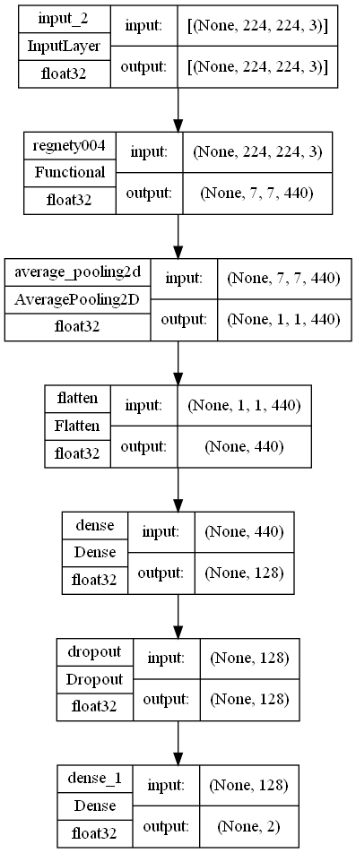

# Face mask detector

This was originally a draft entry for Amazon BuildOn SG hackathon 2021 (hence the repo name).

It is a face mask detector that identifies faces in an image or video and classifies them as wearing a mask or not.

## How to use
Run `predict_video.ipynb` notebook and edit the OpenCV stream as needed. See comments around that line. It supports inference on a single image, a video file, and webcam or any camera input.

All required model weights are saved in this repository.

## Architecture
It uses a ResNet10 model with 300x300px input as face detector. Then, the localized face is being cropped out and passed onto the face mask classifier, which is a pretrained RegnetY-400MF model with Global Average Pooling 2D and linear layer with swish activation. Below is the model architecture:

The model was trained by me on a mixture of many public facemask datasets and my own dataset from scraping Google Image Search, total of 22309 labeled images. The model can be trained on a RTX3080Ti in less than 2 minutes (about 5 epochs it will converge to 99.95+% accuracy on validation set). If you want my training dataset, please email me at aliencaocao@gmail.com.

If you have any questions, please open a Discussion thread.
